Using Cloud Storage with Node.js
================================

# Major Problem

I can not run "Add Book" function very well. App will get stuck when [Save] button having been pressed.

1. Enter all data on "Add Book" form and press [Save] button.

  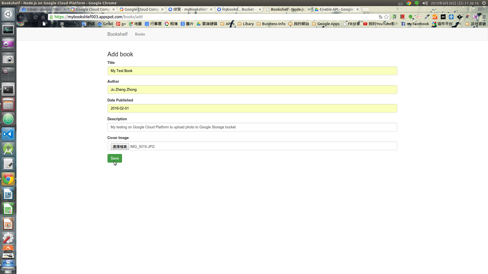

2. Message show up on status bar and get stucked

  After the [Save] button has been pressed, I can see message show up on status bar. The message told me that waiting for response from web site.

  But the app get stucked here........

  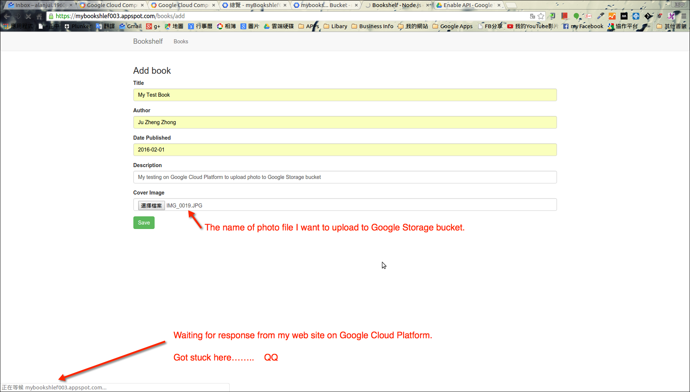

3. The flow of code.

  I have traced the source code, by debug tool from Visual Studio Code.

  When the save button on the "Add Book" have been pressed, the middleware "lib/images.js" will call two fuction: multer(), processUploads() to upload my photo file to Google Storage bucket.

  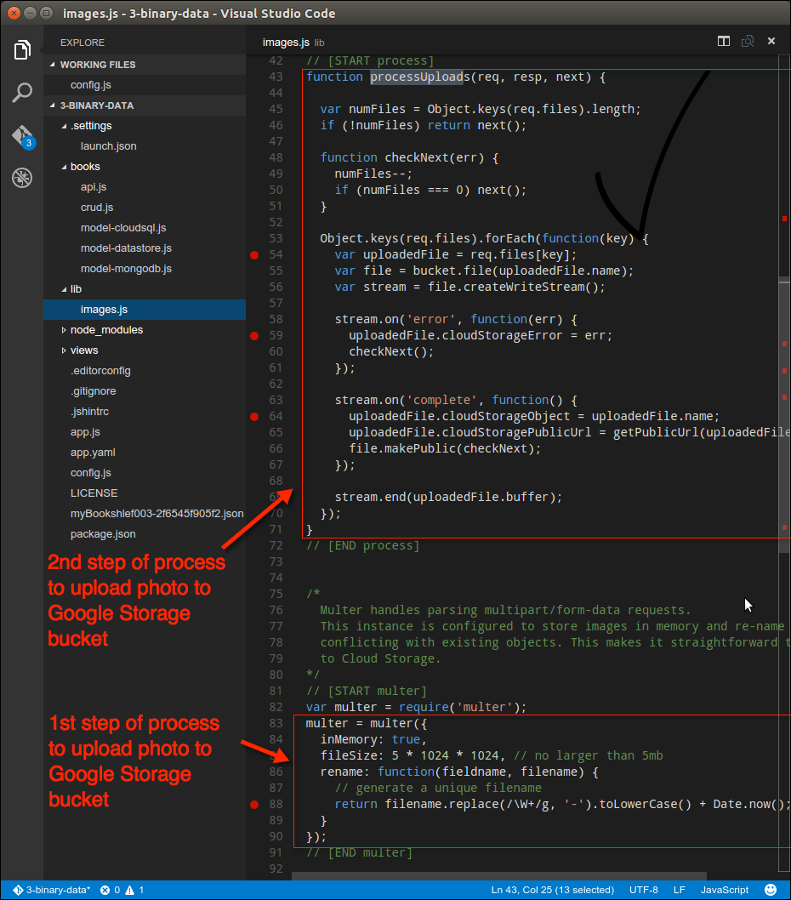

  After photo have been uploaded, then process will come back to router.get('/:bbok', function get(req, res){ ..... }), Line 105 - 112 on books/crud.js.

  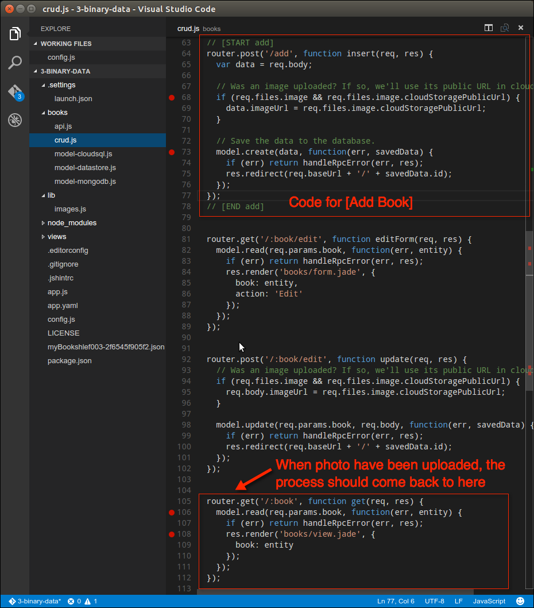

  As you can see the figure below, I can make sure the photo have bees assigned on the "Add Book" form, truly has been uploaed to Google Storage bucket.

  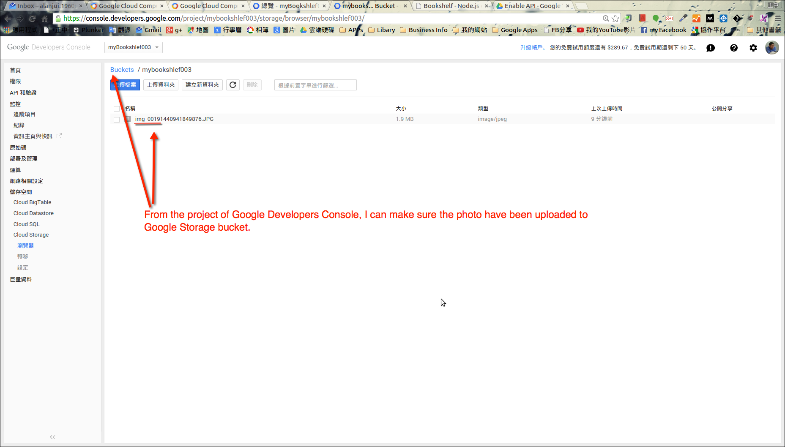

# Job Has Been Done

  Tasks that I have followed and completed.

  1. Followed all steps on "Before you begin" section

  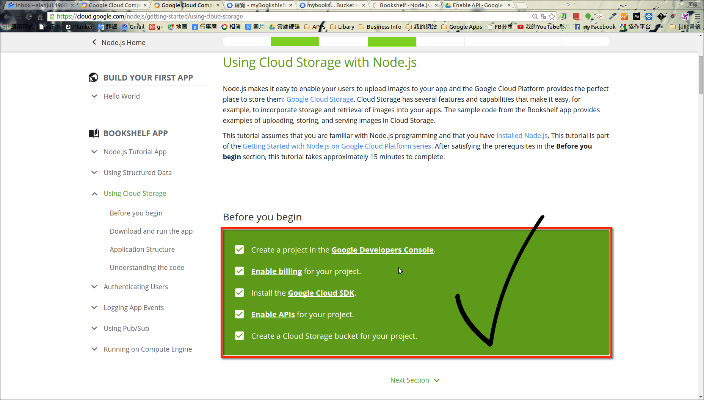

  2. Download App and Do Configuration Setting

  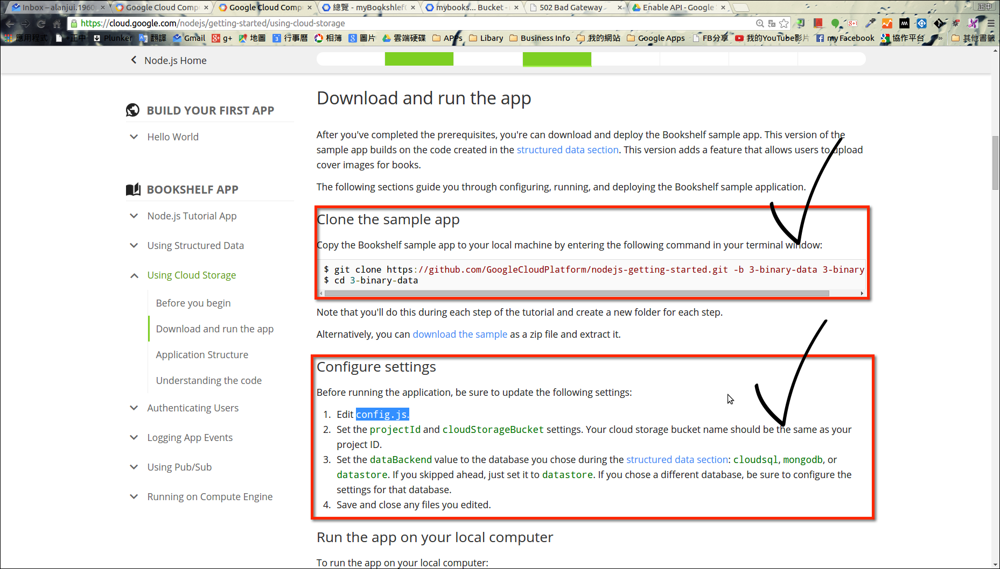

  3. Run App on Local Site and Google Cloud Platform

  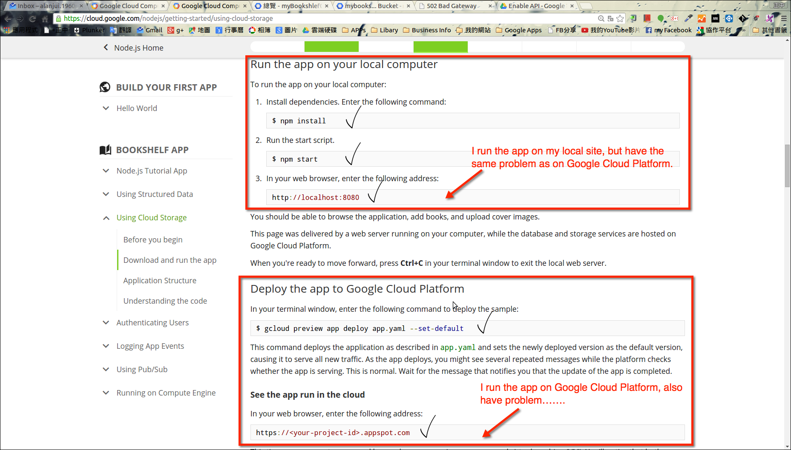

# Supporting HELP needed

Totally have no idea, did I do the right thing to create a certificate for Google APIs.

The procedures I have done for create certificate listed below:

1.

  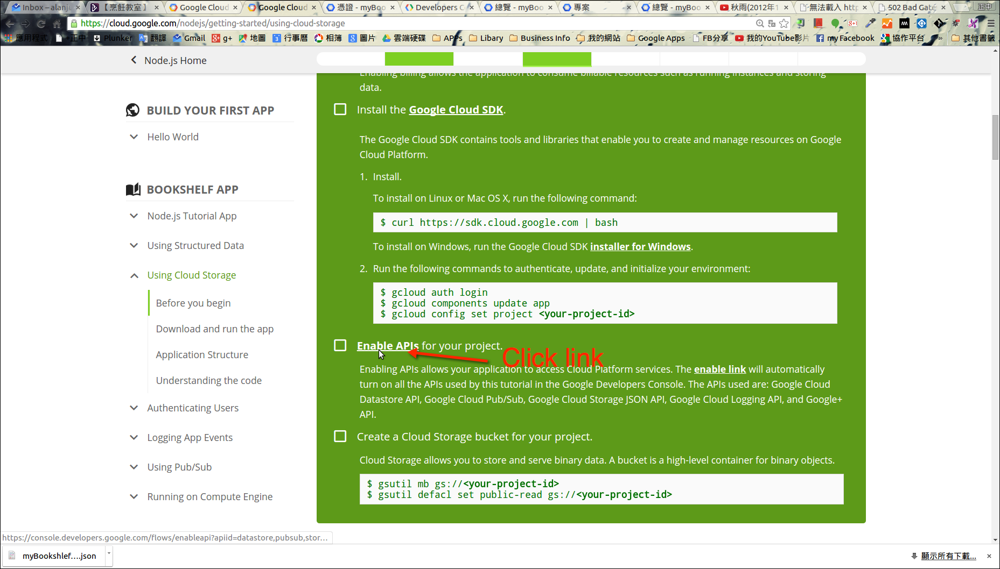

2.

  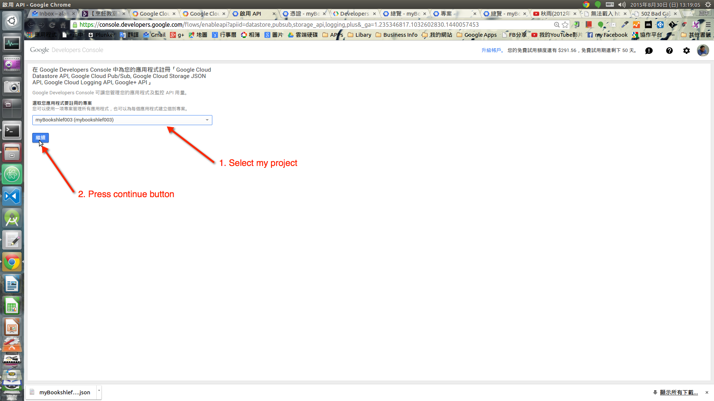

3.

  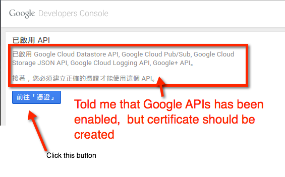

4.

  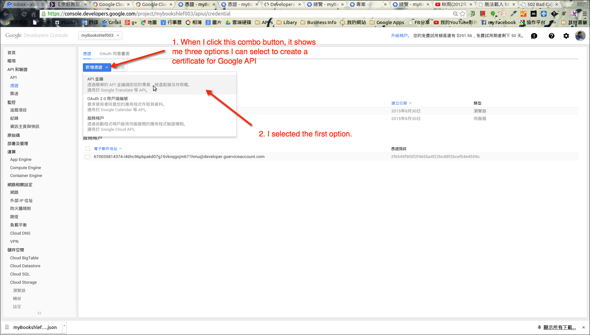

5.

  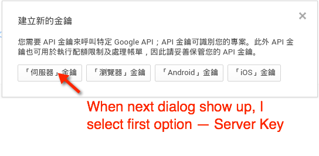

6.

  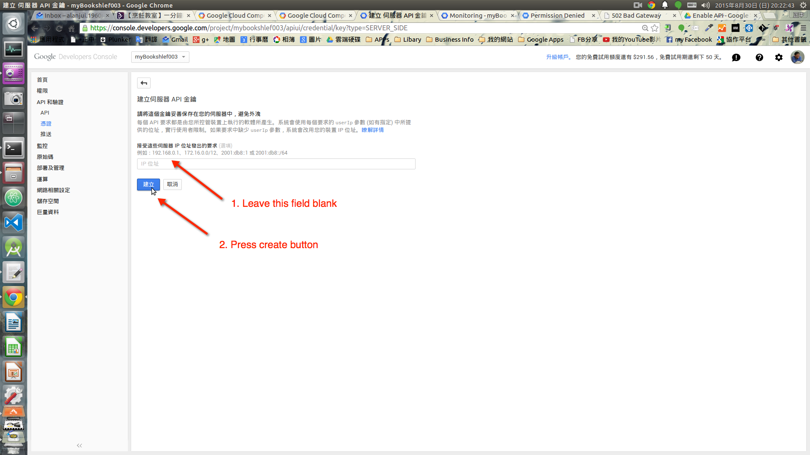

7.

  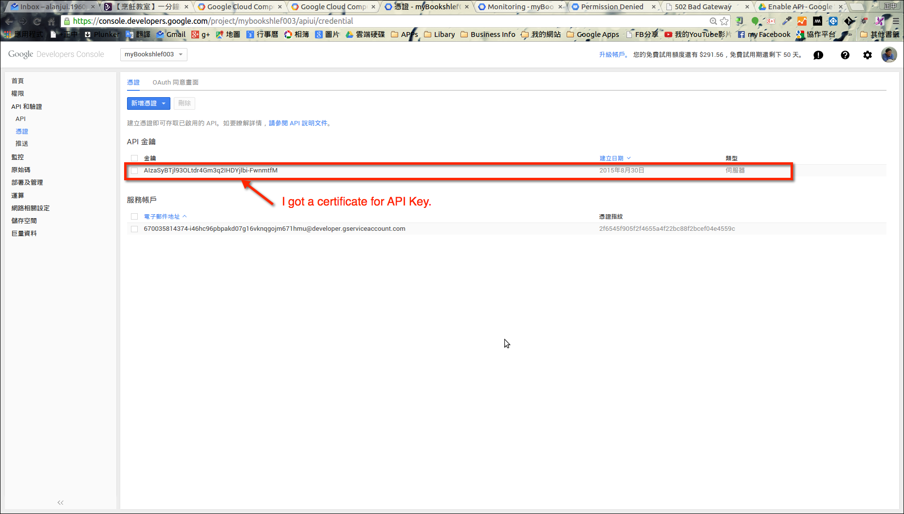
